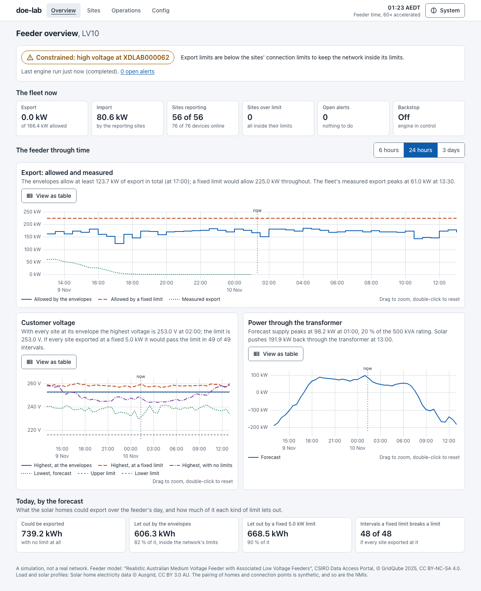
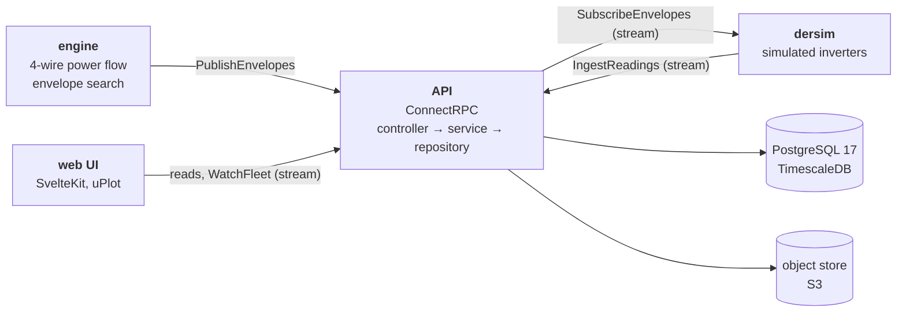
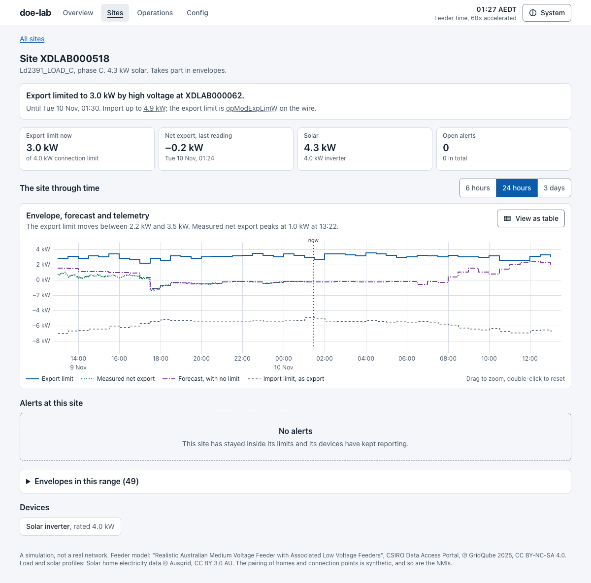
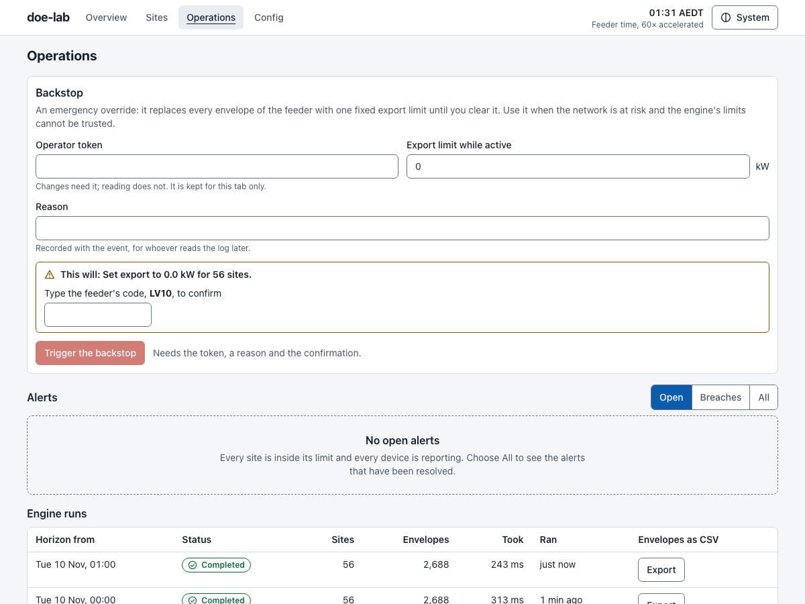

# doe-lab

Dynamic operating envelopes (DOEs) on a real Australian low-voltage feeder,
end to end:

- an **engine** computes how much each home may export and import in each
  half hour without pushing the street past its limits
- an **API** stores those limits and streams them to devices
- **simulated inverters** obey them, and a few are made not to
- a **web UI** shows an operator what is happening



A home with solar usually gets one fixed export limit, often 5 kW. On this
feeder that limit would push voltage past the upper limit in every interval
of the day if every participating home used it. The envelopes hold the
highest voltage at the limit, and still let most of the solar out.

A simulation, not a real network. Not affiliated with CSIRO, GridQube,
Ausgrid or any network operator. The NMIs are synthetic; there is no customer
data.

## Quick start

Needs Go 1.27, [bun](https://bun.sh), [just](https://just.systems),
[sqlc](https://sqlc.dev) and podman with `podman compose`.

```sh
git clone https://github.com/g0itb4/doe-lab.git
cd doe-lab
just setup    # once: dependencies, generated code, git hooks
just demo     # the whole stack on a fresh database; Ctrl-C stops it
```

Open <http://localhost:5273>.

- The first run downloads the two datasets. After that it is up in about 30 s.
- Feeder time runs at 60× the wall clock: a day passes in 24 minutes.
- To change anything on Operations or Config, the token is
  `dev-operator-token`.

## Commands

```sh
# run
just demo           # everything below, on a fresh database
just up             # Postgres with TimescaleDB, and an S3 gateway
just data           # download the datasets and verify their checksums
just import         # LV10 and a year of profiles into the database
just dev            # API on :3100, web UI on :5273, both in watch mode
just engine-loop    # the engine: a run now, then one every two intervals
just dersim         # the simulated devices
just obs            # Prometheus on :9290, Grafana on :3300
just nuke           # destroy the dev database and the object store

# test
just check          # every git hook on every file, as CI does
just test           # everything: hooks, both Go tiers, the engine's time budget, e2e
just test-db        # the Go tier that needs a real TimescaleDB
just e2e            # the built web app in Playwright, with an axe scan
just bench          # engine benchmarks

# optional: the assistant, off unless the API has a key
ANTHROPIC_API_KEY=<key> just demo

# the API speaks plain HTTP and JSON as well as gRPC
curl -s -X POST -H 'content-type: application/json' \
  -d '{"nmi":"XDLAB000014"}' \
  http://localhost:3100/doelab.v1.EnvelopeService/GetCurrentEnvelope
```

`just` alone lists every recipe.

## How it fits together



- The engine and the devices are clients of the API. Neither opens the
  database.
- The PostgreSQL schema is the source of truth: Go structs and proto
  resources mirror the tables, and a test fails when they drift.
- Envelopes are immutable. A publish is idempotent and all or nothing.
- A site over its limit, or a silent device, raises an alert. An operator
  **backstop** overrides every envelope at once.
- The assistant is a language model with four read-only lookups, a rate
  limit and a daily budget.

| Path | What |
| ---- | ---- |
| `apps/api` | Go: the engine, the API and `dersim`, one module |
| `apps/web` | SvelteKit operator UI |
| `packages/db` | Migrations and queries; [schema diagram](packages/db/README.md) |
| `proto` | The API; [OpenAPI description](docs/openapi/doelab.openapi.yaml) |
| `infra` | Compose for development; [Ansible and deploy for one server](infra/prod/README.md) |
| `CONTRIBUTING.md` | [Layering, conventions, hook rules](CONTRIBUTING.md) |
| `llm` | [The index a coding agent reads first](llm/index.md) |

| | |
| --- | --- |
|  |  |

## The model

Feeder **LV10** of CSIRO's realistic Australian feeder set: 223 buses, 94
single-phase customers, one 500 kVA transformer, four wires. Load and solar
are a year of half-hourly measurements from Ausgrid's solar home data.

The forecast is the measured profile, so there is no forecast error. The
limits use CSIP-AUS names (`opModExpLimW`); the transport is ConnectRPC, not
IEEE 2030.5. Every assumption, its reason, and what the demo is not:
[`docs/model.md`](docs/model.md).

## Measured

Each number comes from a test, a benchmark or a document in this repo.

| What | Result | Where |
| ---- | ------ | ----- |
| Power flow against OpenDSS | Within 0.34 mV (1.5 × 10⁻⁶ pu) | `internal/engine/golden_test.go` |
| A day of envelopes, 94 sites, one thread | 0.24 s | `just bench` |
| Dispatch at 10,000 subscriptions, one laptop | p99 739 ms, none failed | [`docs/load-test.md`](docs/load-test.md) |
| Go coverage floors | 100 % for engine, domain, services, server; none under 90 % | `apps/api/coverage.json` |
| Web UI | No WCAG 2.2 AA violation; Lighthouse performance 98 to 99 | [`docs/ux-audit.md`](docs/ux-audit.md) |

Git hooks ([prek](https://prek.j178.dev)) hold every commit to formatting,
lint, a secret scan and the coverage floors. CI runs the same `just` recipes.

## Data and licences

The code is under the PolyForm Noncommercial License 1.0.0
([`LICENSE`](LICENSE)): free to use, change and share for any purpose but a
commercial one.

| Data | Source | Licence |
| ---- | ------ | ------- |
| The feeder | "Realistic Australian Medium Voltage Feeder with Associated Low Voltage Feeders", CSIRO Data Access Portal, DOI [10.25919/ghnz-bk28](https://doi.org/10.25919/ghnz-bk28). © GridQube 2025 | CC BY-NC-SA 4.0 |
| Load and solar | Solar home electricity data © Ausgrid. Archive copy provided by Pierre Haessig | CC BY 3.0 AU |

The raw data is not in the repo; `just data` downloads it. Files derived from
the CSIRO feeder keep its licence: see
[`data/derived/LICENSE`](data/derived/LICENSE) and
[`data/SOURCES.md`](data/SOURCES.md).
