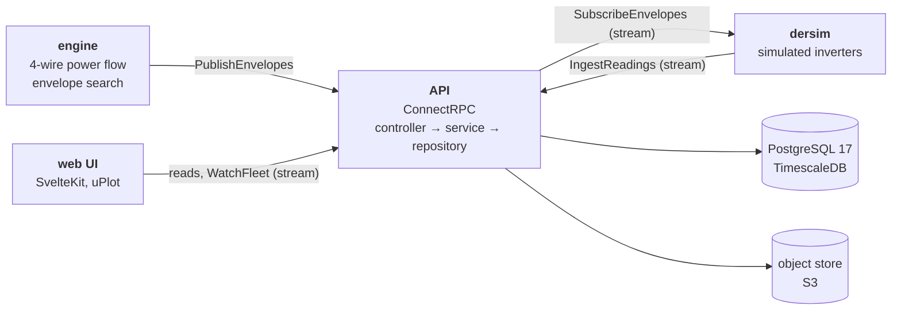

# doe-lab

Dynamic operating envelopes on a real Australian low-voltage feeder, end to
end: an engine computes how much each home may export without pushing the
street past its limits, an API stores and dispatches those limits, simulated
inverters obey them (and a few do not), and a web UI shows an operator what
is happening.


An independent demonstration. It is not affiliated with CSIRO, GridQube,
Ausgrid or any network operator, it is a simulation and not a real network,
and it holds no customer data: the NMIs are synthetic.

## The problem it shows

A home with solar is usually given one fixed export limit, often 5 kW,
chosen so that a street survives its worst hour. For most hours that limit
is too low, and when every roof on a street has solar it is no longer safe
either. A **dynamic operating envelope** (DOE) replaces it with a limit for
each interval, computed from the state of the network: high when the street
has room, low when it does not.

The demo puts both on one chart. On this feeder, in the demo's
configuration, a fixed 5 kW limit would push the voltage past the upper
limit in every interval of the day if every participating home exported at
it. The envelopes hold the highest voltage at the limit and no higher, and
still let out most of what the homes could export. The overview page shows
the numbers for the day in progress.

## What is in it



| Part | What it does |
| ---- | ------------ |
| **Engine** (`apps/api/internal/engine`) | An unbalanced four-wire power flow written for this project, and a search for the largest export and import limit that keeps every customer voltage, the transformer and every cable inside its rating. Pure Go: no I/O, no clock |
| **API** (`apps/api`) | ConnectRPC (Connect, gRPC and gRPC-Web on one port). Envelopes are immutable; a publish is idempotent and all or nothing; a device subscribes to its envelope over a server stream |
| **Schema** (`packages/db`) | The PostgreSQL schema is the source of truth. The Go structs and the proto resources mirror the tables, and a test fails when they drift |
| **Simulated devices** (`dersim`) | One virtual inverter per site, with a battery or an EV charger at some. Each listens for its envelope, curtails its solar to stay inside it, and reports. A few ignore their limit or go silent, on purpose |
| **Compliance** | A site that exports above its limit for longer than a grace period gets an alert; so does a device that stops reporting. An operator can override every envelope with a **backstop** |
| **Web UI** (`apps/web`) | Four pages for three readers: an operator (is the feeder safe now?), a planner (why is this site limited?), and a first-time visitor |
| **Observability** | A trace and a duration for every RPC, metrics for dispatch, runs and alerts, and a Grafana dashboard |

The engine and the devices are clients of the API and nothing else. Neither
opens the database.

## The model, and what it assumes

The network is feeder **LV10** of CSIRO's "Realistic Australian Medium
Voltage Feeder with Associated Low Voltage Feeders": 223 buses, 94
single-phase customers, one 500 kVA 11/0.433 kV transformer, four wires.
The load and solar of each home are a year of half-hourly measurements from
Ausgrid's solar home data.

| Assumption | Value | Why |
| ---------- | ----- | --- |
| Homes on connection points | Ausgrid homes are assigned to LV10's customers with a fixed seed | The two datasets describe different places; the pairing is synthetic |
| Solar scale | ×3 at import, a setting of the config | The profiles are from 2010 to 2013, when a typical system was 1 to 2 kW |
| Who takes part | 60 % of sites; a quarter of those have a battery, a fifth an EV charger | The rest are forecast, not controlled: their solar is what the envelopes work around |
| Transformer tap | One step (2.5 %) below the dataset's nominal | At nominal tap the unloaded feeder sits 3 V under the upper voltage limit, with no room for any export |
| Voltage band | 216.2 V to 253 V (0.94 to 1.10 pu of 230 V) | The Australian standard range: 230 V +10 %, −6 % |
| Cable ratings | Assumed from the cable type, and marked as assumed in the schema | The dataset gives impedances, not ratings |
| Power factor | Load at 0.95 lagging, solar at unity | The profiles carry energy only |
| Allocation | Equal: every participating site gets the same limit. Proportional to the connection limit is the other policy | The policy is a setting, with a version history |
| Forecast | The measured profile of the same local date and time in the profile year | A perfect forecast. The devices then stray from it: cloud and load noise |

An envelope is computed for the case where every participating site uses
its whole limit at once, which is what makes it safe to hand out. Each
search step is a full nonlinear power flow; nothing is linearised.

## Measured

Every number here comes from a test, a benchmark or a document in this
repo.

| What | Result | Where |
| ---- | ------ | ----- |
| Power flow against OpenDSS, LV10, five operating points | Phase-to-neutral voltage within 0.34 mV (1.5 × 10⁻⁶ pu); the test's tolerance is 5 × 10⁻⁶ pu | `internal/engine/golden_test.go` |
| A day of envelopes (48 intervals, 94 sites), one thread, Apple M2 | 0.24 s, 5.1 ms per interval; the budget in the test is 1 s | `just bench` |
| One power flow, tree-ordered against dense | 126 µs against 6.6 ms | `just bench` |
| An engine run through the API: 2,688 envelopes for 56 sites | About 0.3 s, publish included | the engine's log |
| Dispatch at 10,000 subscriptions, one laptop | p50 330 ms, p99 739 ms from write to arrival; none failed; API at 461 MB | [`docs/load-test.md`](docs/load-test.md) |
| Dispatch at 1,000 subscriptions | p99 78 ms | [`docs/load-test.md`](docs/load-test.md) |
| Go coverage floors | 100 % for the engine, the domain, the services, the server and the proto mapping; no package under 90 % | `apps/api/coverage.json` |
| Web UI accessibility | No WCAG 2.2 AA violation on five pages, in both themes, at 360 px and 1440 px (axe-core) | [`docs/ux-audit.md`](docs/ux-audit.md) |
| Web UI, Lighthouse mobile | Performance 98 to 99, accessibility 100, LCP 2.0 to 2.3 s, CLS 0 | [`docs/ux-audit.md`](docs/ux-audit.md) |
| Web UI first load | 84 to 96 kB gzipped per page; the budget is 120 kB | `just build-web` |

## Run it

You need Go 1.27, [bun](https://bun.sh), [just](https://just.systems),
[sqlc](https://sqlc.dev) and a container runtime (the recipes use
`podman compose`).

```sh
just setup          # dependencies, generated code, git hooks
just up             # Postgres with TimescaleDB, and an S3 gateway
just data           # download the two datasets and verify their checksums
just import         # LV10 and a year of profiles into the database

just dev            # the API on :3100 and the web UI on :5273
just engine-loop    # in a second terminal: a run every two intervals
just dersim         # in a third: the simulated devices
```

Open <http://localhost:5273>. Feeder time runs at sixty times the wall
clock, so a day passes in 24 minutes. The Operations and Config pages ask
for the operator token to change anything; in development it is
`dev-operator-token`.

`just obs` adds Prometheus and Grafana with the dashboard provisioned.
`just` alone lists every recipe.

## The API

The schema comes first: a migration, then the generated rows, the domain
struct, the proto resource, and the standard methods (`Get`, `List`,
`Create`, `Update`, `Delete`) where the table allows them. Envelopes have
no update and no delete.

| Service | For |
| ------- | --- |
| `FeederService`, `SiteService`, `DeviceService` | The network model and what is connected to it |
| `EnvelopeConfigService` | The policy and the limits, as immutable versions |
| `EnvelopeRunService` | The engine's runs, their intervals, and a CSV export to the object store |
| `EnvelopeService` | `PublishEnvelopes` (idempotent), `GetCurrentEnvelope`, `SubscribeEnvelopes` (server stream) |
| `TelemetryService` | `IngestReadings` (client stream), the fleet's live summary, the feeder and site series, the daily report |
| `AlertService`, `BackstopService` | Breaches, silent devices, and the operator's override |

The limits carry their CSIP-AUS names on the wire (`opModExpLimW`,
`opModImpLimW`); the transport is ConnectRPC, not IEEE 2030.5.

```sh
curl -s -X POST -H 'content-type: application/json' \
  -d '{"nmi":"XDLAB000014"}' \
  http://localhost:3100/doelab.v1.EnvelopeService/GetCurrentEnvelope
```

The whole surface is described in
[`docs/openapi/doelab.openapi.yaml`](docs/openapi/doelab.openapi.yaml),
generated from the protos, and the schema with its diagram in
[`packages/db/README.md`](packages/db/README.md).

## Screens

| | |
| --- | --- |
|  |  |
| **A site**: why it is limited, in one sentence, then the envelope against what the site did | **Operations**: the backstop control states its impact and needs a typed confirmation |

## How it is kept honest

- **Git hooks** ([prek](https://prek.j178.dev)): formatting, linters
  (including the layering rules, as `depguard`), a secret scan, and the unit
  tests with per-package coverage floors that only go up. `just check` runs
  them all.
- **Two Go test tiers**: an offline tier that the hook runs, and a container
  tier against a real TimescaleDB that checks every constraint, that tables,
  structs and protos agree, and that every `List` query is served by an
  index.
- **One conformance suite, two stores**: the in-memory store that the unit
  tests use passes the same suite as the Postgres one.
- **The web UI** is tested in a real browser: components with coverage
  thresholds, then the built app end to end with an accessibility scan.
- **CI** runs all of it ([`.github/workflows/ci.yml`](.github/workflows/ci.yml)).

## What it is not

- Not a product, and not a model of any real network operator's systems.
- Not IEEE 2030.5: the envelope semantics follow CSIP-AUS, the transport
  does not.
- Not a forecast: the engine is given the measured profile. Forecast error
  is the next thing a real system has to face, and this one does not.
- One feeder. The engine solves a low-voltage feeder on its own; the
  medium-voltage network above it is a fixed source.
- State estimation is out of scope: the engine trusts its inputs.

## Data and licences

The code is under the PolyForm Noncommercial License 1.0.0
([`LICENSE`](LICENSE)): free to use, change and share for any purpose but a
commercial one.

| Data | Source | Licence |
| ---- | ------ | ------- |
| The feeder | "Realistic Australian Medium Voltage Feeder with Associated Low Voltage Feeders", CSIRO Data Access Portal, DOI [10.25919/ghnz-bk28](https://doi.org/10.25919/ghnz-bk28). © GridQube 2025 | CC BY-NC-SA 4.0 |
| Load and solar | Solar home electricity data © Ausgrid. Archive copy provided by Pierre Haessig | CC BY 3.0 AU |

The raw data is not in the repo; `just data` downloads it. What is derived
from the CSIRO feeder (the test fixtures of the engine, and the database
seed) carries its non-commercial, share-alike licence: see
[`data/derived/LICENSE`](data/derived/LICENSE) and
[`data/SOURCES.md`](data/SOURCES.md).
