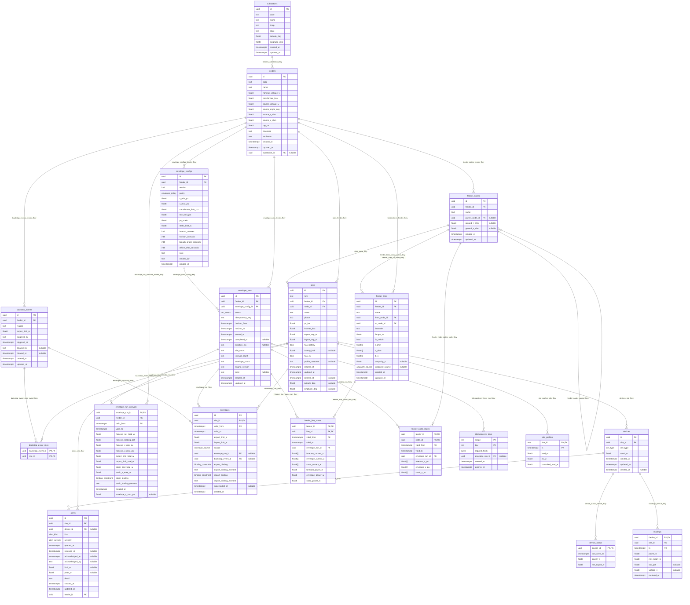

# packages/db: the schema

**The PostgreSQL schema is the source of truth for the data model.** Everything
else is derived from it, in this order:

```
packages/db/migrations/*.sql      tables, types, constraints, indexes, comments
        │  sqlc reads the migrations; no database needed
        ▼
apps/api/internal/repo/pg/gen     row types and queries (generated)
        │  internal/repo/pg maps rows to
        ▼
apps/api/internal/domain          one struct per table: same fields, units, nullability
        │  internal/protomap maps to
        ▼
proto/doelab/v1/*.proto           one resource message per table,
                                  with Get / List / Create / Update / Delete
```

Nothing downstream may hold a field, a nullability, an enum value or a
constraint that the schema does not. Tests enforce it (see "What the tests
check").

## Layout

| Path | What |
| --- | --- |
| `migrations/` | golang-migrate files, `YYYYMMDDHHMMSS_name.{up,down}.sql`. Applied by `just migrate up` |
| `queries/` | One `.sql` file per resource, in the standard shapes below. Compiled by sqlc |
| `sqlc.yaml` | sqlc configuration. Output goes to `apps/api/internal/repo/pg/gen` |
| `sqlc/timescaledb_shim.sql` | Signatures of the TimescaleDB functions the migrations call. Read by sqlc only; never applied |

## Adding a field

Three edits and one command:

1. The migration: the column, its `CHECK`, its `COMMENT`, and an index if a
   `List` filters or sorts on it.
2. The `.proto` message: the field with the same name, `optional` if the column
   is nullable, and a protovalidate rule that mirrors the `CHECK`.
3. `internal/domain` (the field, with its `db` tag) and `internal/protomap`
   (both directions).

Then `just gen`. The parity test fails until all three agree.

## Conventions

- **Keys.** Primary keys are `uuid` (UUIDv7, time-ordered), named `id`. Natural
  keys are `UNIQUE` as well: `feeders.code`, `sites.nmi`, `(feeder_id, name)`.
- **Foreign keys** are named `<table>_<what>_fkey`, state `ON DELETE`
  explicitly, and are indexed. Where a child must belong to the same parent
  as another row, the key is composite: a site's node is a node *of the site's
  feeder* (`sites_node_fkey`), a reading's device belongs *to the reading's
  site* (`readings_device_fkey`).
- **Units are in the name:** `_w`, `_v`, `_a`, `_kva`, `_kw`, `_kwh`, `_m`,
  `_ohm`, `_s` (siemens), `_pct`, `_pu`, `_deg`, `_seconds`, `_minutes`.
- **Time is `timestamptz`.** A period is `valid_from` and `valid_to`,
  half-open.
- **Two clocks.** `valid_from`, `valid_to`, `ts`, `horizon_*`, `triggered_at`,
  `cleared_at`, `opened_at`, `resolved_at` and `last_seen_at` are **feeder
  time**: the clock of the simulation, equal to wall-clock time at speed 1 and
  ahead of it when the demo is accelerated. `created_at`, `updated_at`,
  `received_at`, `started_at`, `completed_at`, `superseded_at` and
  `acknowledged_at` are wall-clock.
- **Integrity is declared, not coded.** Uniqueness, "one active row",
  immutability and valid ranges are constraints, partial unique indexes and
  triggers. The service may check first to give a better error; it is never
  the only guard.
- **Every protovalidate rule has a matching constraint here.** The rule gives
  the caller a good error; the constraint binds every writer.
- **Soft delete** (`deleted_at`) only on `sites` and `devices`, which history
  refers to. Uniqueness on a soft-deleted table is partial
  (`WHERE deleted_at IS NULL`), with one exception: `sites.nmi`, because an NMI
  is never reused.
- **Comments.** Every table has a `COMMENT`, and every column whose meaning or
  unit is not plain from its name. sqlc copies them into the generated Go.

### Derived conventions (adapted from Nest)

A business table is one with an `updated_at` column. `apply_conventions()`
finds them in the catalog and installs:

- `<table>_set_updated_at`: owns `updated_at`. Never set it by hand.
- `<table>_history` and `<table>_truncate_history`: every change is recorded
  in `row_history`, with the actor from `set_actor()`. `Store.Tx` sets the
  actor as the first statement of every transaction.
- `<table>_cascade_soft_delete` on a table with `deleted_at`: a soft delete
  follows `ON DELETE CASCADE` foreign keys.

**End every `.up.sql` that creates or alters a business table with
`SELECT apply_conventions();`.** `just migrate up` runs `assert_conventions()`
afterwards and fails when a table is missing a trigger.

Tables without `updated_at` are not targets, on purpose: `envelope_configs` and
`envelopes` are immutable (their rows are their own history), the hypertables
would flood the audit log, and `device_status`, `feeder_node_states` and
`feeder_line_states` are state: the latest of each, replaced as it changes.

A trigger that `apply_conventions()` installs names every column of its table.
A `.down.sql` that drops a column of a business table drops the table's
`_set_updated_at` trigger first (`drop_trigger_if_present`) and ends with
`SELECT apply_conventions();`.

### Immutable tables

| Table | Rule | Enforced by |
| --- | --- | --- |
| `envelope_configs` | No `UPDATE`, no `DELETE`. A change is a new version | trigger `envelope_configs_immutable` |
| `envelopes` | No `DELETE`. The only `UPDATE` is setting `superseded_at`, once | trigger `envelopes_immutable` |
| `row_history` | Append-only | triggers `row_history_append_only`, `row_history_no_truncate` |

### TimescaleDB

`site_profiles`, `envelopes` and `readings` are hypertables. Three things
follow:

- Every unique index includes the partition column. That is why `envelopes`
  has the key `(site_id, valid_from, id)`.
- A hypertable cannot carry an exclusion constraint. "No two active envelopes
  of a site overlap" is held by a grid instead: intervals start on a 5-minute
  boundary and last 5, 15, 30 or 60 minutes (`envelopes_on_grid`,
  `envelopes_period_allowed`), a feeder uses one interval length, and
  `envelopes_one_active_key` allows one active row per `(site_id, valid_from)`.
- A constraint on a chunk is reported with a prefix
  (`_hyper_2_1_chunk_envelopes_one_active_key`). `repo/pg` strips it.

`site_power_1m` is a continuous aggregate with real-time aggregation on. Its
refresh policy has open offsets, because feeder time can be ahead of `now()`.
`fleet_1m` and `site_compliance_1m` are plain views over it.

A migration file runs as one statement batch in one implicit transaction, so
a continuous aggregate is created `WITH NO DATA`.

## Query shapes

Each resource file in `queries/` uses the same shapes:

| Query | Shape |
| --- | --- |
| `Get<Resource>` | by `id`; soft-deleted rows excluded |
| `List<Resources>` | keyset pagination: `WHERE <key> > $after ORDER BY <key> LIMIT $n`. The repository asks for `n + 1` rows to learn whether there is a next page |
| `Create<Resource>` | `INSERT ... RETURNING *`; the server sets `id` and timestamps |
| `Update<Resource>` | sets only the mutable columns, whatever the caller sends |
| `SoftDelete<Resource>` | sets `deleted_at` on a live row |

A `List` filter that may be absent is written
`(sqlc.narg(x)::type IS NULL OR column = sqlc.narg(x))`.

## What the tests check

In `apps/api/internal/repo/pg`, in the container tier (`just test`):

| Test | Checks |
| --- | --- |
| `TestMigrationsUpDownUp` | up, down and up again are clean; the three hypertables exist; `assert_conventions()` passes |
| `TestSchema*` | one statement per constraint that must refuse it, checked by SQLSTATE and constraint name |
| `TestParity` | for each resource, the table's columns, the domain struct's fields and the proto message's fields are the same set, with the same nullability and compatible types; every table is listed |
| `TestEnumParity` | every Postgres enum has a proto enum with the same values in the same order |
| `TestListQueriesUseAnIndex` | each `List` query, as the repository really sends it, has a plan with no sequential scan and no sort |
| `TestConformance` | the repository suite that also runs against the in-memory store |
| `TestERD` | the diagram below matches the schema |

## Entity-relationship diagram

Generated from the catalog. To update it after a migration:

```sh
cd apps/api && DOELAB_TEST_DB=1 TESTCONTAINERS_RYUK_DISABLED=true go test ./internal/repo/pg -run TestERD -update
```

<!-- erd:start -->

<!-- erd:end -->
